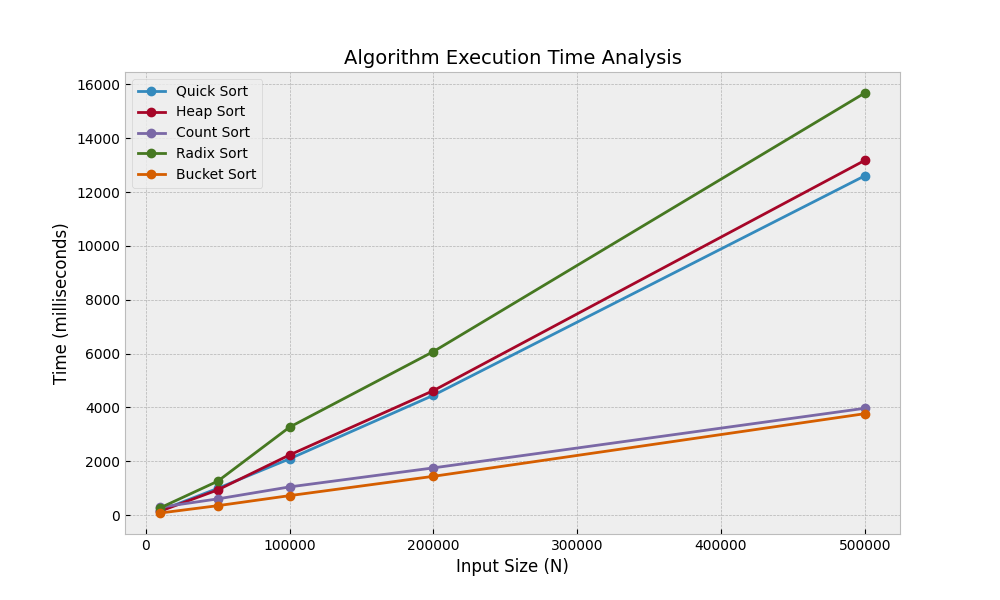

# 📊 Advanced Sorting Algorithms Benchmark
> **MSc Course Project - Advanced Algorithms**  
> **Faculty of Computers and Artificial Intelligence - Cairo University**


## 🧐 Project Objective
This project performs a comparative analysis of 5 fundamental sorting algorithms based on **Execution Time** and **Memory Usage**. The goal is to understand the trade-offs between comparison-based sorts and distribution-based sorts under randomized, sorted, and sparse data distributions.

## 🚀 Algorithms Implemented

| Algorithm | Type | Strategy | Complexity (Avg) | Special Implementation Note |
| :--- | :--- | :--- | :--- | :--- |
| **Quick Sort** | Comparison | Divide & Conquer | $O(N \log N)$ | Uses **Randomized Pivot** to avoid $O(N^2)$ worst-case. |
| **Heap Sort** | Comparison | Binary Heap | $O(N \log N)$ | Implemented **In-Place** ($O(1)$ Aux Space). |
| **Count Sort** | Distribution | Frequency Count | $O(N + K)$ | Extremely fast for small integer ranges. |
| **Radix Sort** | Distribution | Digit-by-Digit | $O(NK)$ | Stable sort for large integers. |
| **Bucket Sort** | Distribution | Scatter-Gather | $O(N + K)$ | Optimized for uniform float distributions $[0, 1)$. |

## 📂 Project Structure

```text
Advanced_Algorithms_MSc/
├── Code/                   # Source Code
│   ├── algorithms/         # Sorting Logic
│   ├── data_generator.py   # Dataset Factory
│   ├── benchmark_driver.py # Performance Analysis Script
│   └── test_integration.py # Unit Tests
├── Results/                # Generated Data & Visuals
│   ├── analysis_results.csv
│   ├── Project_1_Results.xlsx
│   ├── graph_time_complexity.png
│   └── graph_memory_usage.png
└── Report/                 # Final PDF Submission
    └── Final_Report.pdf
```

## 🛠️ How to Run
1. **Clone the Repository**:
   ```bash
   git clone https://github.com/yourusername/Advanced_Algorithms_MSc.git
    cd Advanced_Algorithms_MSc
    ```
2. **Install Dependencies**:
   ```bash
    pip install -r requirements.txt
    ```
3. **Run Benchmarks**:
    ```bash
     python benchmark_driver.py
     ```
4. **Visualize Results**:
    ```bash
     python visualize_results.py
     ```

## 📊 Performance Results
The performance results are saved in `analysis_results.csv` and visualized in `Project_1_Results.xlsx`.
### 1. Execution Time Analysis
*Observation: Distribution-based sorts (Bucket/Count) outperform comparison sorts (Quick/Heap) on large datasets.*



### 2. Memory Usage Analysis
*Observation: Heap Sort is the most memory-efficient (In-Place), while Bucket Sort consumes significant memory due to list overhead.*


